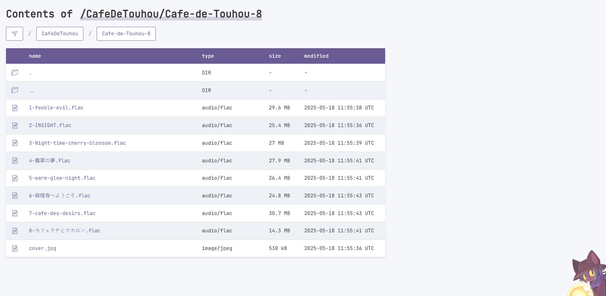
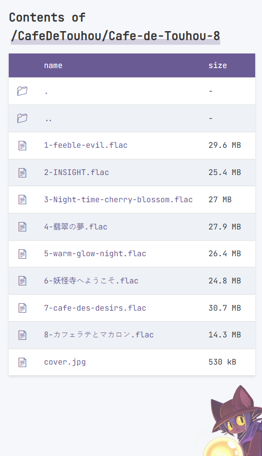
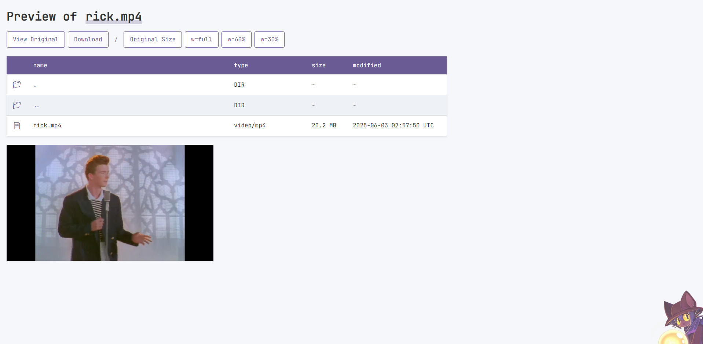
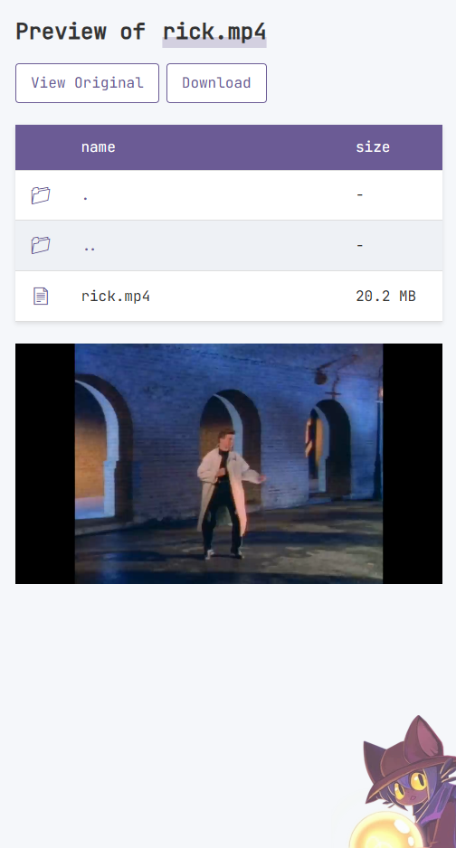

# ✍️ indexgen
**The static page generator generates index.html and viewer.html** for S3 and S3 compatible (e.g. minio) storage.

## Try it now!
https://pub.pmh.codes

## Features
* Scan bucket files with minimal API calls for faster speed and cost-effectiveness
* [Easy and fully customizable HTML template powered by ejs](./templates/)
* [Ignored file/directory list support](./configs/ignore)

## Screenshots for default template
### index.html (desktop)


### index.html (mobile)


### viewer.html (desktop)


### viewer.html (mobile)


### 100% Lighthouse optimized


## How to Run
minimal example:
```sh
docker run -ite S3_BUCKET_NAME=mybucket \
  ghcr.io/pmh-only/indexgen:latest
```

full example:
```sh
docker run -it \
  -e S3_ACCESS_TOKEN=kLn3QDurDd \
  -e S3_SECRET_TOKEN=gQf2iXlRRx2e7uh6ehMJtMc0QSZ41pJ6 \
  -e S3_ENDPOINT=https://s3.pmh.codes \
  -e S3_REGION=us-east-2 \
  -e S3_BUCKET_NAME=mybucket \
  ghcr.io/pmh-only/indexgen:latest
```

## Copyright notice
&copy; 2025. Minhyeok Park. <pmh_only@pmh.codes>. All rights reserved.\
All source codes in this repository are MIT licensed.
